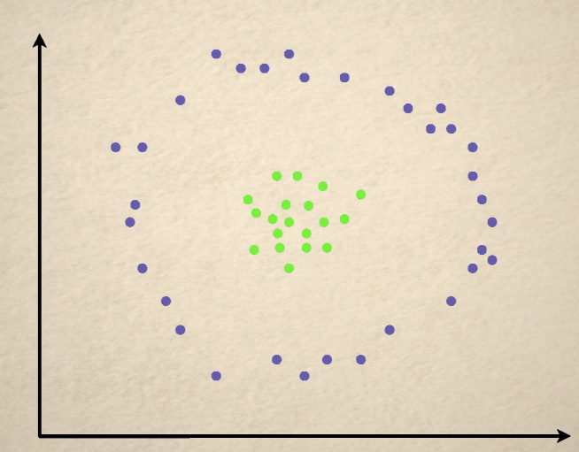

# Clustering

The most common algorithm taught for clustering is the k-means algorithm.  This uses a distance function and simple alogithm to fit the centers of the k-clusters.  

## The Distance Function

There are many possible distance functions that one could use, though they may cause your algorithm to never converge. In the popular k-means algorithm the squared euclidean distance is used. 

## The Algorithm

K-means proceeds in a two-step fashion iteratively until it converges.  Convergance is reached when data point assignements don't change from one step to the next.  For k-means convergance is garunteed in finate steps, though no 

**Assignement** All data points are assigned to their closest cluster defined by the squared euclidean distance. 

**Update** Cluster centers are updated to be the mean of their data points assigned to them. 

## Model Criticism

We can typically try to evaluate a model internally or externally.  In the external case, we might hold out labeled data.  We could then use the labels to evaluate how well our clustering worked (though if you have labeled data, why not just create a classifier?). In the interanl case, we want to try to use just the data on hand to check the consistancy of the model.  For example, one can fit multiple models on subsets of the data and see how sensitive the cluster centers are to small perterbations in the data.

### Global Disimilarity
Using our defined distance function, we can calculate the total distance of each data point from their respective cluster center.  The larger this total distance is, the worse the clustering.

## Popular Optimizations

### Sensible starting points
Above, we don't specify how to initialize the clusters.  One common optimization is to try to initialize cluster centers close to where you hypothesize the cluster centers actually are. K-means++ is one such algorithm with a sensible initialization strategy. 

### Penalizing Large-K
When determining the correct K, sometimes we can use theory to guess a reasonable value.  However when trying to determine purely from data alone, it can be helpful to add a penalty term to the objective function to incentivize the minimally necessary K. 

### Allow for flexible covariance
The way we define our distance measure, k-means considers all clusters to have equal covariance.  However, if we allow for this to be more flexible, as with Gaussian Mixture Models, then we can fit clusters of different sizes.

### Transforming the Data
Consider this example where a cluster is within a second cluster.  

The challenge here is that a sphere by definition won't work here.  We need to create a partitioning that isolates the center group and allowing for the outer group to be a single cluster.  One way to accomplish this task is by transforming the space the data points live in.  In three dimensions, for example, the above example can be linearly separable. 

### Flexible K
Suppose our dataset isn't fixed, but is constantly growing through interactions with people  Then we would anticipate that the numbers of clusters might change as well, as people introduce novel ideas.  Nonparametric Bayes (or MAD-Bayes) is mentioned as one possible approach. 

### Allow for Mixed Membership 
Implicitly in k-means we assume that a data point can only be assigned to a single cluster.  However it is easy to contrive examples where we would want to be able to assign a data point to multiple clusters.  A common approach is Latent Dirichlet Allocation. Another interesting way to approach this I've seen is heirarchical graphical methods (one called [Hierarchical Navigable Small World](https://arxiv.org/ftp/arxiv/papers/1603/1603.09320.pdf))